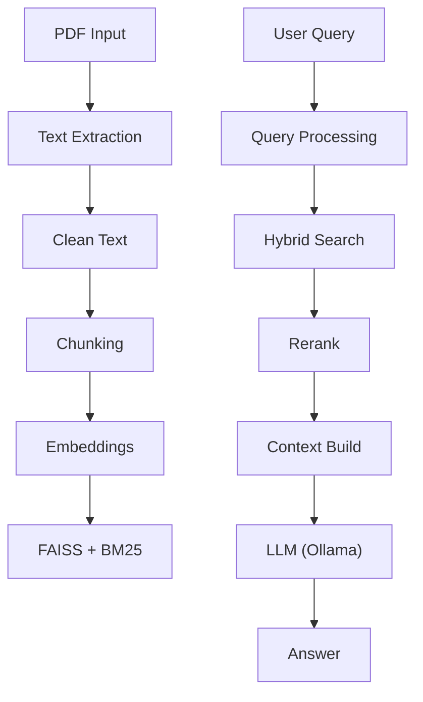

# 🚀 RAG PDF Q&A Pipeline


> A high-performance **Retrieval-Augmented Generation (RAG)** system to query PDFs using local LLMs.

---

## ✨ Features

- 📄 PDF text extraction using PyMuPDF
- ✂️ Smart sentence-based chunking with overlap
- 🧠 Embeddings using Sentence Transformers
- ⚡ FAISS-powered similarity search
- 🎯 Cross-encoder reranking for accuracy
- 🤖 Local LLM inference via Ollama (`llama3`)
- 💾 Caching for fast repeated queries

---

## 🧱 Architecture



---

## 📁 Project Structure

```
.
├── main.py
├── utilites/
│   ├── file_operations.py
│   ├── pre_processing.py
│   ├── rag_operations.py
│   └── qa.py
├── data/
├── model/
```

---

## ⚙️ Requirements

- Python 3.12+
- Ollama running locally (`http://localhost:11434`)
- `llama3` model installed

---

## 🚀 Installation

### Option 1: Using `uv` (Recommended)

```bash
uv sync
```

### Option 2: Using `pip`

```bash
python -m venv .venv
.\.venv\Scripts\Activate.ps1   # Windows
pip install -U pip
pip install -e .
```

---

## 🧠 Setup Ollama

```bash
ollama serve
```

```bash
ollama pull llama3
```

---

## ▶️ Usage

### Run with single PDF

```bash
python .\main.py ".\data\sample.pdf"
```

### Run with multiple PDFs

```bash
python .\main.py ".\data\a.pdf" ".\data\b.pdf"
```

### Interactive mode

```bash
python .\main.py
```

---

## 💬 Example Query

```text
Q: What are the main topics in this document?
A: The document covers...
```

---

## ⚡ How It Works

### 🔹 Preprocessing (One-time)

- Extract text from PDF
- Chunk into sentences (5 size, 1 overlap)
- Generate embeddings (`all-MiniLM-L6-v2`)
- Store FAISS index

### 🔹 Query Pipeline

- Embed query
- Retrieve Top-K chunks
- Rerank using cross-encoder
- Pass context to LLM
- Generate final answer

---

## 📊 Performance Notes

- ⚡ First run slower (model downloads ~100MB)
- 🚀 Subsequent runs are fast (cached)
- 🧠 Works fully offline (local LLM)

---

## 🛠 Troubleshooting

### Ollama not running

```bash
ollama serve
```

### Model missing

```bash
ollama pull llama3
```

### FAISS error

```bash
pip install faiss-cpu>=1.13.2
```

---

## ⚠️ Limitations

- Single-threaded processing
- Entire PDF loaded in memory
- Fixed chunking strategy
- CLI-only interaction

---

## 🔮 Future Enhancements

- ✅ Web UI (React + FastAPI)
- ✅ Multi-document search
- ✅ Streaming responses
- ✅ Metadata + source attribution
- ✅ Parallel processing
- ✅ Configurable models

---

## 🤝 Contributing

Pull requests are welcome. For major changes, open an issue first.

---

## 📜 License

MIT License

---

## ⭐ Show Your Support

If you like this project:

- ⭐ Star the repo
- 🍴 Fork it
- 🧠 Share with others

---

## 👨‍💻 Author

Built by **Udbhav**  
Backend Developer | AI Enthusiast

---
